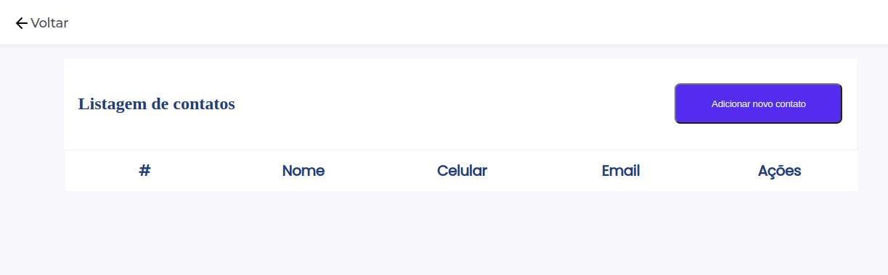
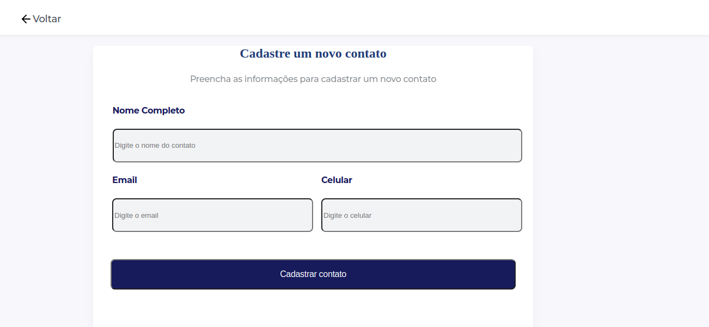
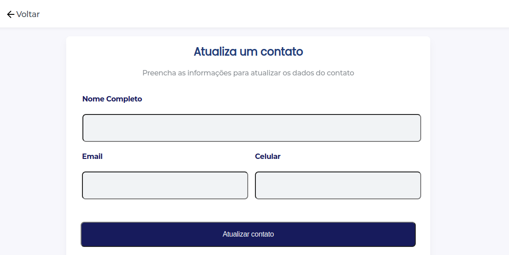

# Boas vindas ao Desafio Agenda de Contatos

Este projeto utiliza uma API fornecida e endpoints para manipulação de dados, desenvolvendo um CRUD. Os dados são renderizados através da conexão com a aplicação back end, validada por bearer token.

## Funcionalidades da aplicação

Com esta aplicação podemos visualizar a lista contatos, criar novos contatos, atualizar os contatos existentes e exluir o contato, exibindo as informações de nome, email e telefone.
Todas as informações utilizadas estão armazenadas no banco de dados e passíveis de manipulação.

### Tecnologias utilizadas

Aplicação desenvolvida com `React.js`, com gerenciamento de estado por meio de `Hooks`.
Aplicação recebe e trata promisses proveniente do retorno de informações do projeto `Back End`.
Estilização da página desenvolvida em `css`.

### Acesso ao projeto

Realizado deploy da aplicação na plataforma Surge e disponível em:
* https://welckson_desafio_diwe.surge.sh/

Aplicação BackEnd disponível no repositório:
* https://github.com/welcksonvalentim/ListOfContacts-diwe-challenge/tree/master/list-of-contacts

### Ilustração da aplicação em funcionamento

## Para rodar a aplicação localmente

1. Clone o repositório, com o comando:
    * `git@github.com:welcksonvalentim/ListOfContacts-diwe-challenge.git`

2. Entre na pasta do repositório que você acabou de clonar:
    * `cd ListOfContacts-diwe-challenge`

3. Instale as dependências e inicialize o projeto:
    * `npm install`

4. Inicialize o projeto:
    * `npm start`

### Próximos Passos do Projeto

* Continuidade a estilização dos botões de edição e exclusão de contatos;
* Continuidade ao desenvolvimento de testes;

### Lições Aprendidas com Projeto

* Manipulação de token do tipo bearer;
* Lógica para retornar a página anterior;
* Biblioteca de icones;
